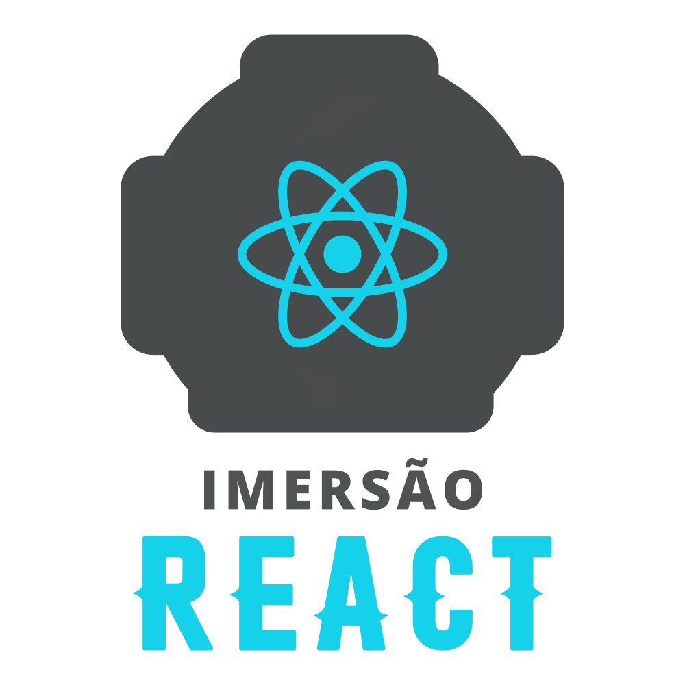

## Semana Imersão React - AluraFlix 

## ⠀⠀⠀⠀ ⠀⠀⠀⠀

## O projeto  **DATAFLIX** foi desenvolvido na [Imersão React Alura](https://www.alura.com.br/imersao-react/), baseando-se no princípio da netflix, porém, compartilhando conteúdo de Data Science.

### [Acesse a plataforma](https://dataflix-phi.vercel.app/)

### Como rodar o projeto?
Após baixar o projeto, acesse ele do seu terminal rode os comandos:

* npm install
* npm start

## License/Licença do Projeto
[MIT License](https://github.com/rubas-dev/dataflix/blob/master/LICENSE)